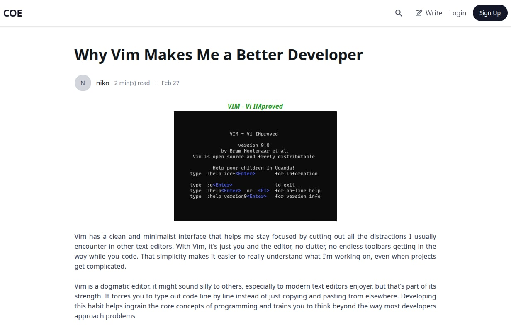
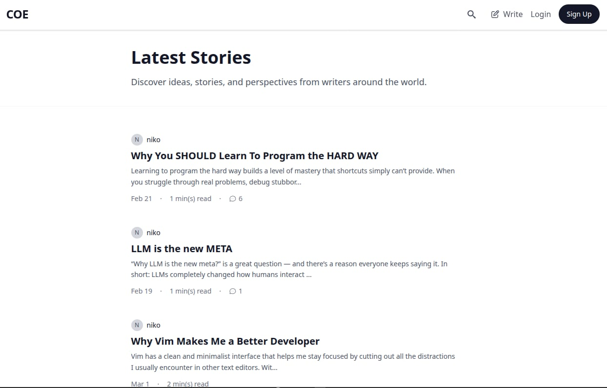

<h3 align="center">Crafts of Expression (Main Client)</h3>

    <b><a href="https://coe-blog-sepia.vercel.app/">https://coe-blog-sepia.vercel.app/</a></b>

    A blogging platform built with React. You can write posts with a rich text editor, sign up for an account, and manage everything from your own dashboard.

 

    API:  
    
        <b><a href="https://coe-api-jeh2.onrender.com/">https://coe-api-jeh2.onrender.com/</a></b>
     

### Key Features
* **Search**: Find posts by searching related to its title or contents.
* **Comments**: Engage with readers through comments on posts.
* **Dashboard**: Personal dashboard to manage your posts (create, edit, delete).
* **Rich Text Editor**: Supports multiple text formats including image upload using TinyMCE.
* **Search & Sorting**: Search and sort blog posts by title and content.

### Tech Stack & Library used
* React 19 + Vite
* TypeScript
* HeroUI + Tailwind CSS
* Framer Motion
* React Router
* TinyMCE (Rich Text Editor)
* React Icons

### Roadmap
- [ ] Likes/bookmark posts
- [ ] User profile
